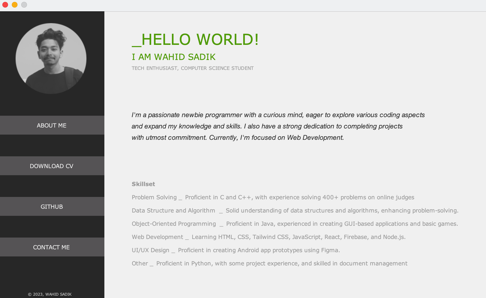

# JavaSwingPortfolio

**Description:**
Swingfolio is a personal portfolio application built using Java Swing. It serves as a showcase for my skills and journey [2023].

**Features:**
- Intuitive user interface created with Java Swing.

**Screenshot**



**How to Run:**
1. Ensure you have Java installed on your machine.
2. Clone this repository: `git clone https://github.com/wahidsadikjishan/JavaSwingPortfolio.git`
3. Compile and run the application.

```bash
cd JavaSwingPortfolio
javac MainPage.java
java MainPage
